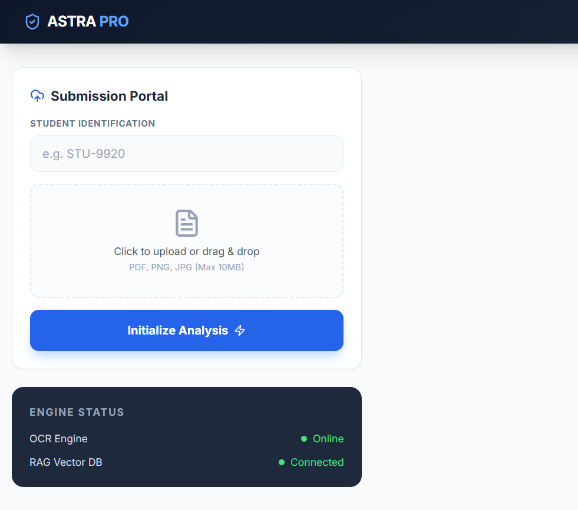

# ASTRA MVP — Authorship Verification System

## Overview

ASTRA is a prototype system designed to verify the authenticity of student assignments by analyzing both textual and visual characteristics. Unlike traditional plagiarism detection tools, ASTRA focuses on **authorship verification** — determining whether a given submission was genuinely produced by the claimed student.

This MVP implements a heuristic-based pipeline combined with retrieval-augmented explainability to simulate a forensic analysis system .

---

## Problem Statement

Educational institutions are increasingly facing challenges such as:

* AI-generated assignments submitted as original work
* Ghostwritten submissions by parents or tutors
* Handwritten copies of AI-generated text
* Lack of systems to verify *who* actually authored the content

Existing tools primarily detect plagiarism, but they do not address authorship integrity.

ASTRA addresses this gap by combining:

* OCR-based text extraction
* Stylometric analysis
* Handwriting similarity estimation
* Composite suspicion scoring
* Explainable AI reasoning layer

---

## System Architecture

```
User Input (PDF/Image + Student ID)
        ↓
OCR Engine (Text Extraction)
        ↓
Stylometry Analysis (AI Detection Heuristics)
        ↓
Handwriting Similarity Engine
        ↓
Suspicion Scoring Engine
        ↓
RAG Explainability Layer
        ↓
Structured JSON Output
```

---

## Core Features

### 1. OCR Intelligence Layer

* Extracts text from images and PDFs
* Uses Tesseract OCR
* Handles basic preprocessing for improved accuracy

### 2. Stylometric Analysis

Detects AI-like writing patterns using:

* Sentence length variance (burstiness)
* Repetition density
* Structural consistency

### 3. Handwriting Similarity Engine

* Compares uploaded assignment with stored reference sample
* Uses OpenCV edge detection and pixel difference
* Outputs similarity score

### 4. Suspicion Scoring Engine

Combines multiple signals into a unified score:

```
final_score =
  0.6 * ai_likelihood +
  0.3 * handwriting_suspicion +
  0.1
```

Risk Levels:

* LOW: 0.0 – 0.35
* MEDIUM: 0.35 – 0.65
* HIGH: 0.65 – 1.0

### 5. Explainability Layer (RAG)

* Uses FAISS + sentence embeddings
* Retrieves relevant text segments
* Generates structured explanations for decisions
* Ensures system is not a black box

---

## Technology Stack

### Backend

* FastAPI
* Python 3.10+

### AI / Processing

* pytesseract
* OpenCV
* numpy
* sentence-transformers
* FAISS

### Utilities

* pdf2image
* uvicorn

---

## Project Structure

```
astra-mvp/
│
├── main.py
├── routes/
│   └── upload.py
├── services/
│   ├── ocr.py
│   ├── stylometry.py
│   ├── handwriting.py
│   ├── scoring.py
│   └── rag.py
├── utils/
│   └── file_handler.py
├── data/
│   ├── uploads/
│   └── samples/
├── static/
│   └── index.html
├── verify_setup.py
├── create_samples.py
└── requirements.txt
```

---

## Setup Instructions

### 1. Clone Repository

```
git clone <your-repo-url>
cd astra-mvp
```

---

### 2. Install Python Dependencies

```
pip install -r requirements.txt
```

---

### 3. Install System Dependencies

#### Tesseract OCR

* Install from: https://github.com/UB-Mannheim/tesseract/wiki
* Default path:

  ```
  C:\Program Files\Tesseract-OCR\
  ```

Add to PATH if not automatically configured.

---

#### Poppler (for PDF support)

* Download from:
  https://github.com/oschwartz10612/poppler-windows/releases

* Extract to:

  ```
  C:\poppler
  ```

Add to PATH:

```
C:\poppler\Library\bin
```

---

### 4. Verify Installation

Run:

```
python verify_setup.py
```

This checks:

* Stylometry calculations
* Scoring logic
* RAG pipeline

---

### 5. Run Application

```
python main.py
```

Server will start at:

```
http://localhost:8000
```

---

## Usage

### Web Interface

1. Open browser at:

   ```
   http://localhost:8000
   ```
2. Enter student ID
3. Upload assignment (PDF/image)
4. View results

---

## API Endpoint

### POST `/upload`

#### Request:

* file (multipart)
* student_id (string)

#### Response:

```
{
  "student_id": "student123",
  "ai_likelihood": 0.72,
  "handwriting_similarity": 0.63,
  "suspicion_score": 0.74,
  "risk_level": "HIGH",
  "ocr_snippet": "...",
  "explanation": "...",
  "flags": [
    "Low burstiness detected",
    "Repetitive phrasing",
    "Handwriting deviation"
  ]
}
```

---

## Testing

### Sample Data

Run:

```
python create_samples.py
```

Creates:

```
data/samples/student123.png
```

---

### Manual Testing Flow

* Upload AI-generated text → expect higher score
* Upload human-written text → expect lower score
* Compare variation in outputs

---

## Design Philosophy

ASTRA is built on the following principles:

* Explainability over black-box models
* Heuristic-first MVP for rapid prototyping
* Modular architecture for future ML integration
* Focus on authorship, not plagiarism

---

## Limitations (MVP)

* Heuristic-based detection (not ML-trained)
* Basic handwriting comparison (no deep embeddings)
* Limited robustness to noisy OCR input
* No authentication or multi-user system

---

## Future Improvements

* CNN-based handwriting embeddings
* Siamese networks for identity verification
* Advanced stylometric modeling
* Multilingual normalization
* Real-time batch processing
* Institutional analytics dashboard

---

## Conclusion

This MVP demonstrates a complete end-to-end pipeline for authorship verification using lightweight techniques and explainable AI. While simplified, it establishes a strong foundation for scaling into a full forensic-grade system.

---
## Author

Developed as a prototype system for AI-based authorship verification.
